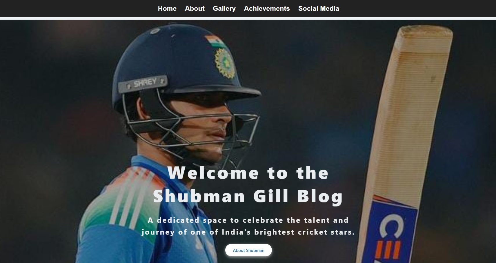

🏏 Shubman Gill Blog(Flask Project)

This is a simple blog website created using Flask, dedicated to Indian cricketer Shubman Gill. It is built for learning purposes while exploring Python and Flask web development.

📚 Purpose

This project was made by Shipali K. to practice Flask and web designing skills. It is not for commercial use.

🖼️ Images

All the images used in this project are taken from Shubman Gill's public Instagram account, only for educational use.

🚀 Features

    • Home page with background image and welcome message  
    • About section with Shubman's bio and photo  
    • Achievements section listing his cricket milestones  
    • Gallery page with multiple images  
    • Social Media links with icons

🛠️ Technologies Used

    • Python  
    • Flask  
    • HTML / CSS  
    • Font Awesome (for icons)

📸 Screenshot

💻 How to Run

    1. Make sure Python is installed.
    2. Install Flask
